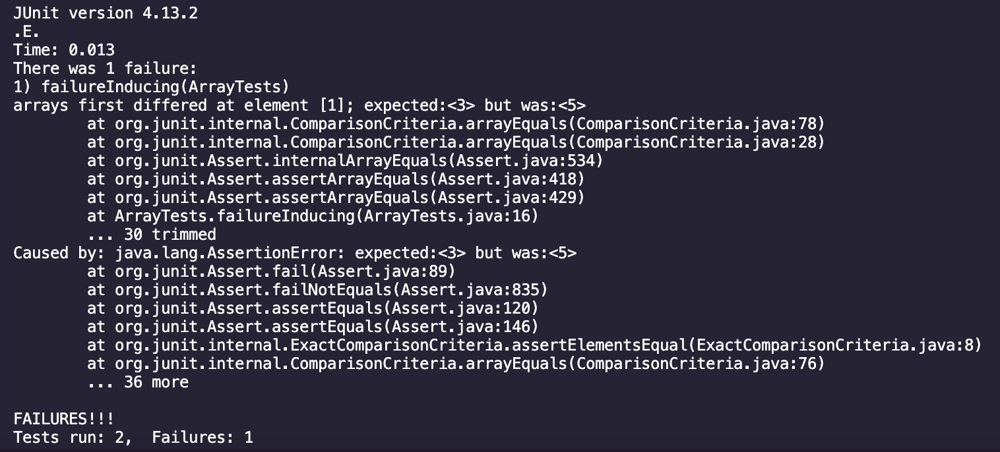

Part 1  
Failure-Inducing Input:
```
@Test 
public void testReverseInPlace() {
    int[] input1 = { 3, 5 };
    ArrayExamples.reverseInPlace(input1);
    assertArrayEquals(new int[]{ 5, 3 }, input1);
}
```

Non-Failure Inducing Input:
```
@Test 
public void testReverseInPlace() {
    int[] input1 = { 3 };
    ArrayExamples.reverseInPlace(input1);
    assertArrayEquals(new int[]{ 3 }, input1);
}
```

The Symptom:


The Bug  
Before Fix:
```
static void reverseInPlace(int[] arr) {
    for(int i = 0; i < arr.length; i += 1) {
      arr[i] = arr[arr.length - i - 1];
    }
}
```
After Fix:
```
static void reverseInPlace(int[] arr) {
    int temp = 0;
    for(int i = 0; i < arr.length / 2; i += 1) {
        temp = arr[i];
        arr[i] = arr[arr.length - 1 - i];
        arr[arr.length - 1 - i] = temp;
    }
}
```
Reasoning:  
The bug fix addresses the issues in the code because originally the code loops through the array and swaps places Once it reached halfway it would swap the places again, resulting in the original array. The fix makes sure we only loop through half the array with the expression ``array.length / 2``. Due to this change in the function, I created to a new variable ``temp`` to store the current value and then swap with the other side of the array ``arr[arr.length - 1 - i]``.  
Part 2

CHATGPT ANSWER

Citation
ChatGPT, Command Line Options, November 17, 2023  
Prompt Given to ChatGPT:  
Consider the commands less, find, and grep. Choose one of them. Online, find 4 interesting command-line options or alternate ways to use the command you chose. To find information about the commands, a simple Web search like “find command-line options” will probably give decent results. There is also a built-in command on many systems called man (short for “manual”) that displays information about commands; you can use man grep, for example, to see a long listing of information about how grep works. Also consider asking ChatGPT!  

ChatGPT output:  
Certainly! Let's explore some interesting command-line options for the `grep` command.

1. **Recursive Search:**
   - Option: `-r` or `--recursive`
   - Example: `grep -r "pattern" /path/to/search`

   This option allows `grep` to search for a pattern recursively in directories and subdirectories. It's handy for finding occurrences in a whole directory tree.

2. **Case Insensitive Search:**
   - Option: `-i` or `--ignore-case`
   - Example: `grep -i "pattern" file.txt`

   This option makes the search case-insensitive, so it will match patterns regardless of case. Useful when you want to find occurrences regardless of whether they are uppercase or lowercase.

3. **Display Line Numbers:**
   - Option: `-n` or `--line-number`
   - Example: `grep -n "pattern" file.txt`

   This option displays the line numbers along with the lines that match the pattern. It helps in quickly locating where the pattern occurs in the file.

4. **Counting Matches:**
   - Option: `-c` or `--count`
   - Example: `grep -c "pattern" file.txt`

   This option counts and displays the number of lines that match the pattern. It's useful when you just want to know how many times a particular pattern occurs in a file.

Remember, you can always refer to the manual pages for `grep` by using the `man` command:

```bash
man grep
```

This will provide comprehensive information about the `grep` command and its various options. Feel free to experiment with these options to tailor your `grep` commands based on your specific needs!

``find -name``:
Example 1:
Description: The ``-name`` option is used to search for files and directories with a specific name.
Find all files named "example.txt" within the current directory and its subdirectories. 
This command finds all the ``.txt`` files in ``\technical`` that start with "chapter" then
prints it to the terminal. These can be files in any directory nested under ``\technical``.

Input:
```
find technical -name "chapter*.txt"
```
Output:
```
technical/911report/chapter-13.4.txt
technical/911report/chapter-13.5.txt
technical/911report/chapter-13.1.txt
technical/911report/chapter-13.2.txt
technical/911report/chapter-13.3.txt
technical/911report/chapter-3.txt
technical/911report/chapter-2.txt
technical/911report/chapter-1.txt
technical/911report/chapter-5.txt
technical/911report/chapter-6.txt
technical/911report/chapter-7.txt
technical/911report/chapter-9.txt
technical/911report/chapter-8.txt
technical/911report/chapter-12.txt
technical/911report/chapter-10.txt
technical/911report/chapter-11.txt
```

Example 2:
This command finds all the ``.txt`` files in ``\technical`` that start with "cc" then
prints it to the terminal. These can be files in any directory nested under ``\technical``.

Input:
```
find technical -name "cc*.txt"
```
Output:
```
technical/biomed/cc991.txt
technical/biomed/cc4.txt
technical/biomed/cc367.txt
technical/biomed/cc3.txt
technical/biomed/cc2190.txt
technical/biomed/cc1843.txt
technical/biomed/cc1856.txt
technical/biomed/cc105.txt
technical/biomed/cc1498.txt
technical/biomed/cc1538.txt
technical/biomed/cc1882.txt
technical/biomed/cc300.txt
technical/biomed/cc1529.txt
technical/biomed/cc103.txt
technical/biomed/cc303.txt
technical/biomed/cc1477.txt
technical/biomed/cc1852.txt
technical/biomed/cc713.txt
technical/biomed/cc1476.txt
technical/biomed/cc2172.txt
technical/biomed/cc2358.txt
technical/biomed/cc2167.txt
technical/biomed/cc2171.txt
technical/biomed/cc2160.txt
technical/biomed/cc1044.txt
technical/biomed/cc1497.txt
technical/biomed/cc1495.txt
technical/biomed/cc350.txt
technical/biomed/cc973.txt
technical/biomed/cc1547.txt
technical/biomed/cc343.txt
```

``find -type d``:
Example 1:
This command prints all the directories under the ``\technical`` directory given the path of ``technical``. 
The ``d`` at the end of the command specifies ``directory``.

Input:
```
find technical -type d
```
Output:
```
technical
technical/government
technical/government/About_LSC
technical/government/Env_Prot_Agen
technical/government/Alcohol_Problems
technical/government/Gen_Account_Office
technical/government/Post_Rate_Comm
technical/government/Media
technical/plos
technical/biomed
technical/911report
```

Example 2:
This command specifies a path directly to the ``media`` directory. The only thing that was displayed was the 
absolute path to the directory. i.e. ``technical/government/media``

Input:
```
find technical/government/media -type d
```
Output:
```
technical/government/media
```

``find -empty``:
Example 1:
The command looks for an empty directory using ``empty``. ``technical`` is a full directory, outputs nothing to the terminal.

Input:
```
find technical -empty
```
Output:
Nothing is output

Example 2:
Looks for an empty directory using ``empty``. Because ``technical/government/media`` 
If it is a full directory, it outputs nothing to the terminal.

Input:
```
find technical/government/media -empty
```
Output:
"No Output" 

``find -type f``:
Example 1:
Looks in ``\technical\911report`` for all files and displays it to the terminal.

Input:
```
find technical/911report -type f
```
Output:
```
technical/911report/chapter-13.4.txt
technical/911report/chapter-13.5.txt
technical/911report/chapter-13.1.txt
technical/911report/chapter-13.2.txt
technical/911report/chapter-13.3.txt
technical/911report/chapter-3.txt
technical/911report/chapter-2.txt
technical/911report/chapter-1.txt
technical/911report/chapter-5.txt
technical/911report/chapter-6.txt
technical/911report/chapter-7.txt
technical/911report/chapter-9.txt
technical/911report/chapter-8.txt
technical/911report/preface.txt
technical/911report/chapter-12.txt
technical/911report/chapter-10.txt
technical/911report/chapter-11.txt
```

Example 2
Looks in ``\government\About_LSC`` for all files and displays it to the terminal.
Input:
```
find technical/government/About_LSC -type f
```
Output:
```
technical/government/About_LSC/LegalServCorp_v_VelazquezSyllabus.txt
technical/government/About_LSC/Progress_report.txt
technical/government/About_LSC/Strategic_report.txt
technical/government/About_LSC/Comments_on_semiannual.txt
technical/government/About_LSC/Special_report_to_congress.txt
technical/government/About_LSC/CONFIG_STANDARDS.txt
technical/government/About_LSC/commission_report.txt
technical/government/About_LSC/LegalServCorp_v_VelazquezDissent.txt
technical/government/About_LSC/ONTARIO_LEGAL_AID_SERIES.txt
technical/government/About_LSC/LegalServCorp_v_VelazquezOpinion.txt
technical/government/About_LSC/diversity_priorities.txt
technical/government/About_LSC/reporting_system.txt
technical/government/About_LSC/State_Planning_Report.txt
technical/government/About_LSC/Protocol_Regarding_Access.txt
technical/government/About_LSC/ODonnell_et_al_v_LSCdecision.txt
technical/government/About_LSC/conference_highlights.txt
technical/government/About_LSC/State_Planning_Special_Report.txt
```
